# Assets List

## Polkadot JS

Polkadot JS

### icons

<figure style="float: none; margin: 10px;">

<figcaption style="font-size: 8px; text-overflow: ellipsis"><code>https://raw.githubusercontent.com/paritytech/substrate-assets/master/assets/polkadotjs/icons/icon.png</code></figcaption>
</figure>

### screenshots

<figure style="float: left; margin: 10px;">
<a href="assets/polkadotjs/screenshots/statemine.png">
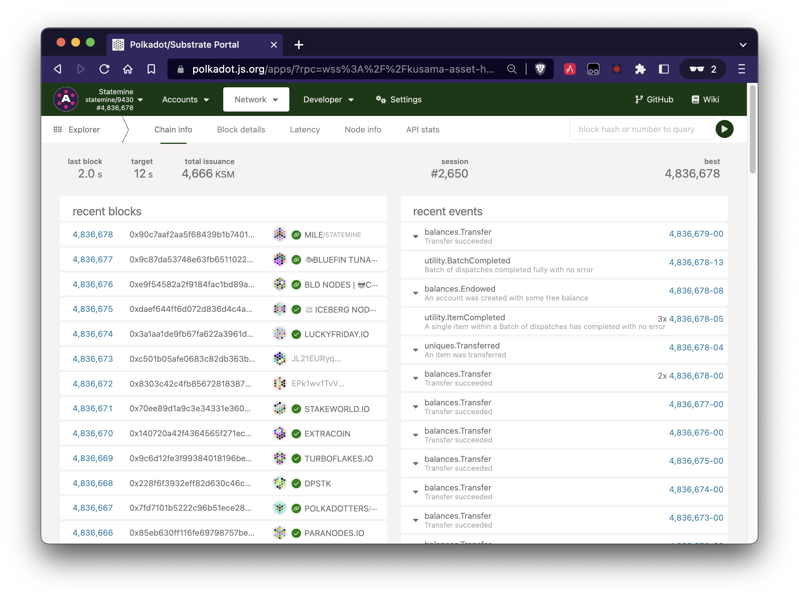
</a>
<figcaption style="font-size: 8px; text-overflow: ellipsis"><code>https://raw.githubusercontent.com/paritytech/substrate-assets/master/assets/polkadotjs/screenshots/statemine.png</code></figcaption>
</figure>

<figure style="float: left; margin: 10px;">
<a href="assets/polkadotjs/screenshots/kusama.png">
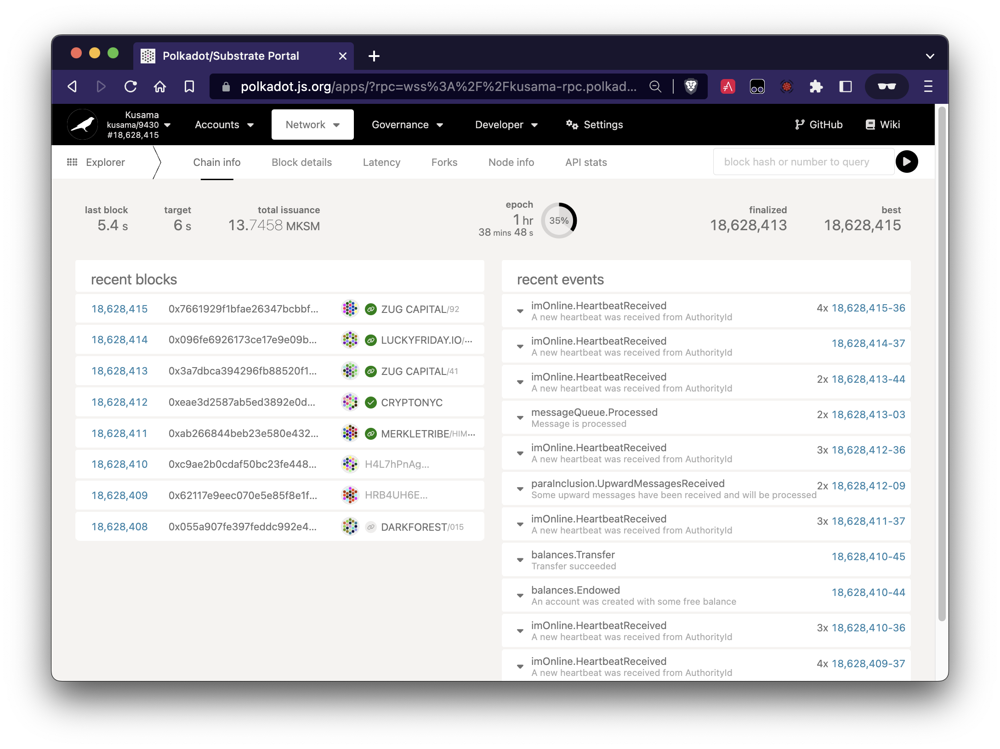
</a>
<figcaption style="font-size: 8px; text-overflow: ellipsis"><code>https://raw.githubusercontent.com/paritytech/substrate-assets/master/assets/polkadotjs/screenshots/kusama.png</code></figcaption>
</figure>

<figure style="float: left; margin: 10px;">
<a href="assets/polkadotjs/screenshots/statemint.png">
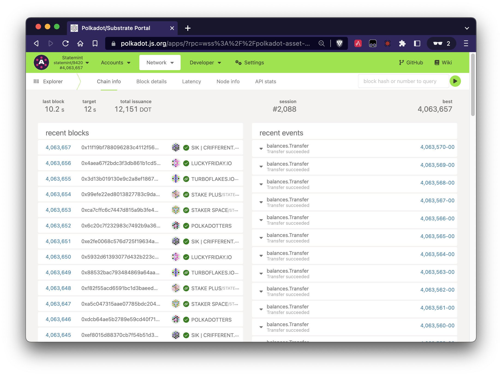
</a>
<figcaption style="font-size: 8px; text-overflow: ellipsis"><code>https://raw.githubusercontent.com/paritytech/substrate-assets/master/assets/polkadotjs/screenshots/statemint.png</code></figcaption>
</figure>

<figure style="float: none; margin: 10px;">
<a href="assets/polkadotjs/screenshots/polkadot.png">
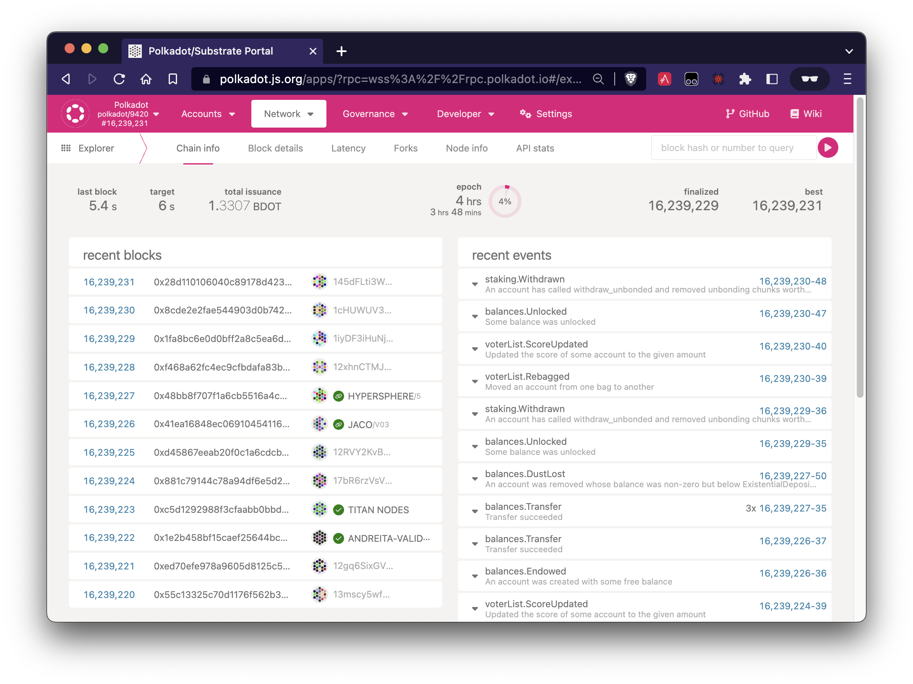
</a>
<figcaption style="font-size: 8px; text-overflow: ellipsis"><code>https://raw.githubusercontent.com/paritytech/substrate-assets/master/assets/polkadotjs/screenshots/polkadot.png</code></figcaption>
</figure>

## Kusama

Kusama relay chain

### icons

<figure style="float: none; margin: 10px;">
<a href="assets/kusama/icons/kusama_icon.svg">
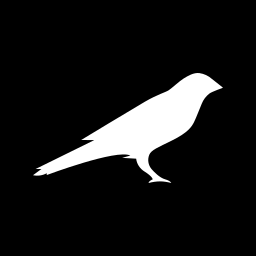
</a>
<figcaption style="font-size: 8px; text-overflow: ellipsis"><code>https://raw.githubusercontent.com/paritytech/substrate-assets/master/assets/kusama/icons/kusama_icon.svg</code></figcaption>
</figure>

### screenshots

<figure style="float: none; margin: 10px;">
<a href="assets/kusama/screenshots/kusama.png">
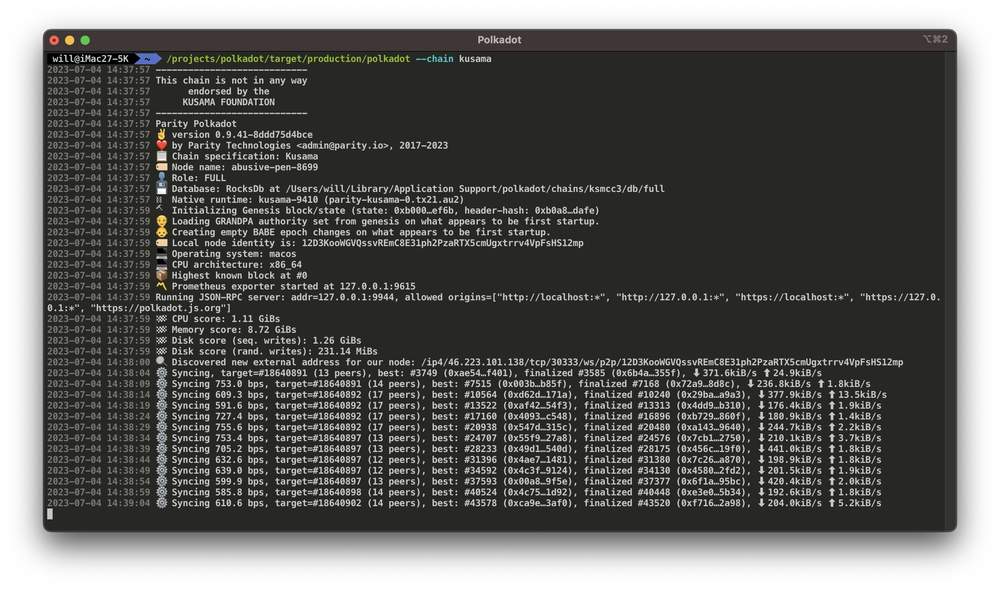
</a>
<figcaption style="font-size: 8px; text-overflow: ellipsis"><code>https://raw.githubusercontent.com/paritytech/substrate-assets/master/assets/kusama/screenshots/kusama.png</code></figcaption>
</figure>

## Polkadot Delegation

Polkadot Delegation is a web app to delegate your votes.

### icons

<figure style="float: none; margin: 10px;">

<figcaption style="font-size: 8px; text-overflow: ellipsis"><code>https://raw.githubusercontent.com/paritytech/substrate-assets/master/assets/polkadot-delegation/icons/governance_icon.svg</code></figcaption>
</figure>

### screenshots

<figure style="float: left; margin: 10px;">
<a href="assets/polkadot-delegation/screenshots/connect.png">
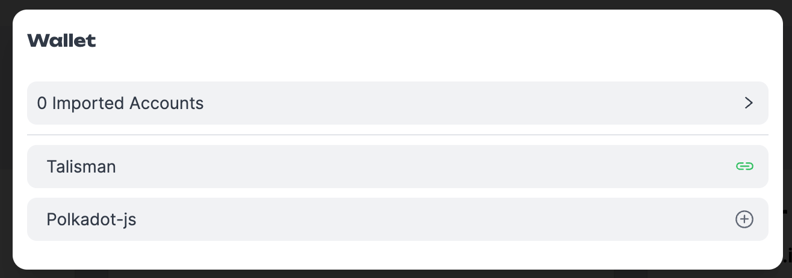
</a>
<figcaption style="font-size: 8px; text-overflow: ellipsis"><code>https://raw.githubusercontent.com/paritytech/substrate-assets/master/assets/polkadot-delegation/screenshots/connect.png</code></figcaption>
</figure>

<figure style="float: left; margin: 10px;">
<a href="assets/polkadot-delegation/screenshots/delegation.png">
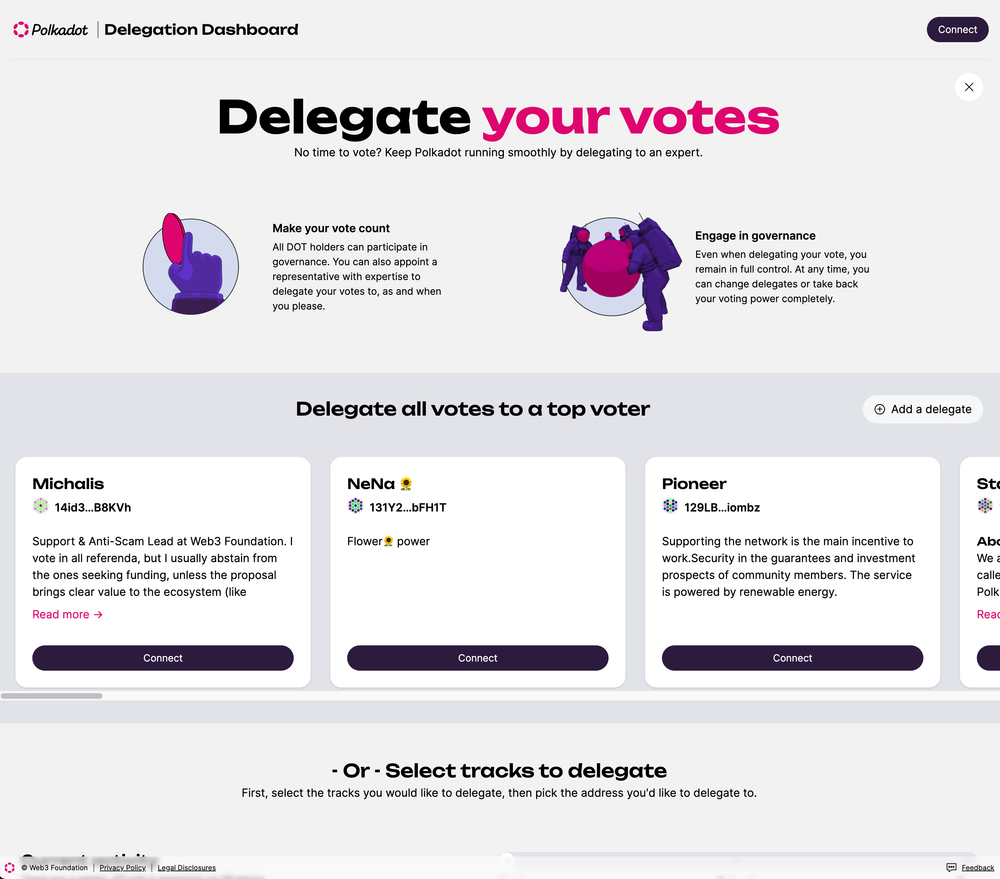
</a>
<figcaption style="font-size: 8px; text-overflow: ellipsis"><code>https://raw.githubusercontent.com/paritytech/substrate-assets/master/assets/polkadot-delegation/screenshots/delegation.png</code></figcaption>
</figure>

<figure style="float: none; margin: 10px;">
<a href="assets/polkadot-delegation/screenshots/page2.png">
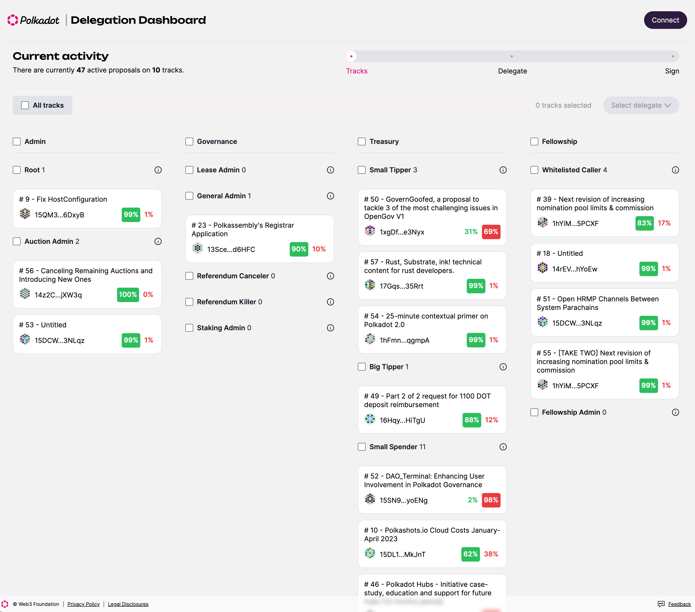
</a>
<figcaption style="font-size: 8px; text-overflow: ellipsis"><code>https://raw.githubusercontent.com/paritytech/substrate-assets/master/assets/polkadot-delegation/screenshots/page2.png</code></figcaption>
</figure>

## Polkadot Staking

Polkadot Staking is a web app to stake your DOT.

### icons

<figure style="float: none; margin: 10px;">
<a href="assets/polkadot-staking/icons/staking_icon.svg">
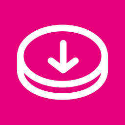
</a>
<figcaption style="font-size: 8px; text-overflow: ellipsis"><code>https://raw.githubusercontent.com/paritytech/substrate-assets/master/assets/polkadot-staking/icons/staking_icon.svg</code></figcaption>
</figure>

### screenshots

<figure style="float: left; margin: 10px;">
<a href="assets/polkadot-staking/screenshots/polkadot-light.png">
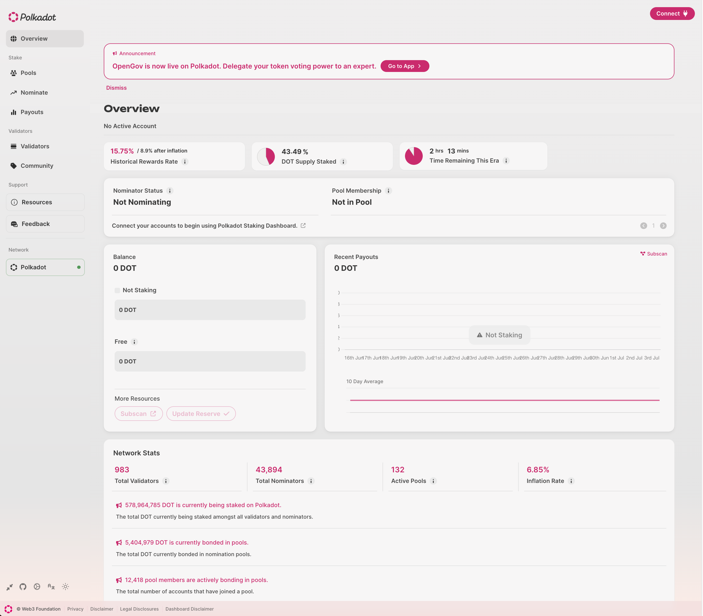
</a>
<figcaption style="font-size: 8px; text-overflow: ellipsis"><code>https://raw.githubusercontent.com/paritytech/substrate-assets/master/assets/polkadot-staking/screenshots/polkadot-light.png</code></figcaption>
</figure>

<figure style="float: left; margin: 10px;">
<a href="assets/polkadot-staking/screenshots/kusama-light.png">
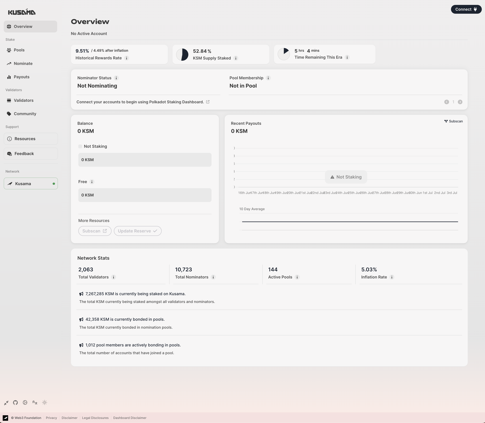
</a>
<figcaption style="font-size: 8px; text-overflow: ellipsis"><code>https://raw.githubusercontent.com/paritytech/substrate-assets/master/assets/polkadot-staking/screenshots/kusama-light.png</code></figcaption>
</figure>

<figure style="float: left; margin: 10px;">
<a href="assets/polkadot-staking/screenshots/polkadot-dark.png">
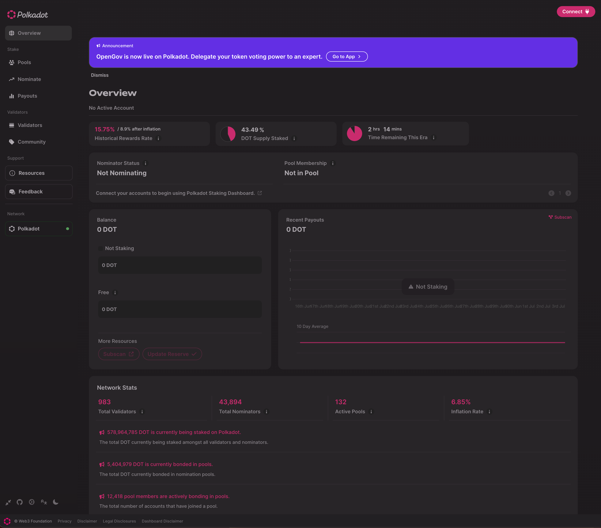
</a>
<figcaption style="font-size: 8px; text-overflow: ellipsis"><code>https://raw.githubusercontent.com/paritytech/substrate-assets/master/assets/polkadot-staking/screenshots/polkadot-dark.png</code></figcaption>
</figure>

<figure style="float: left; margin: 10px;">
<a href="assets/polkadot-staking/screenshots/connect-dark.png">
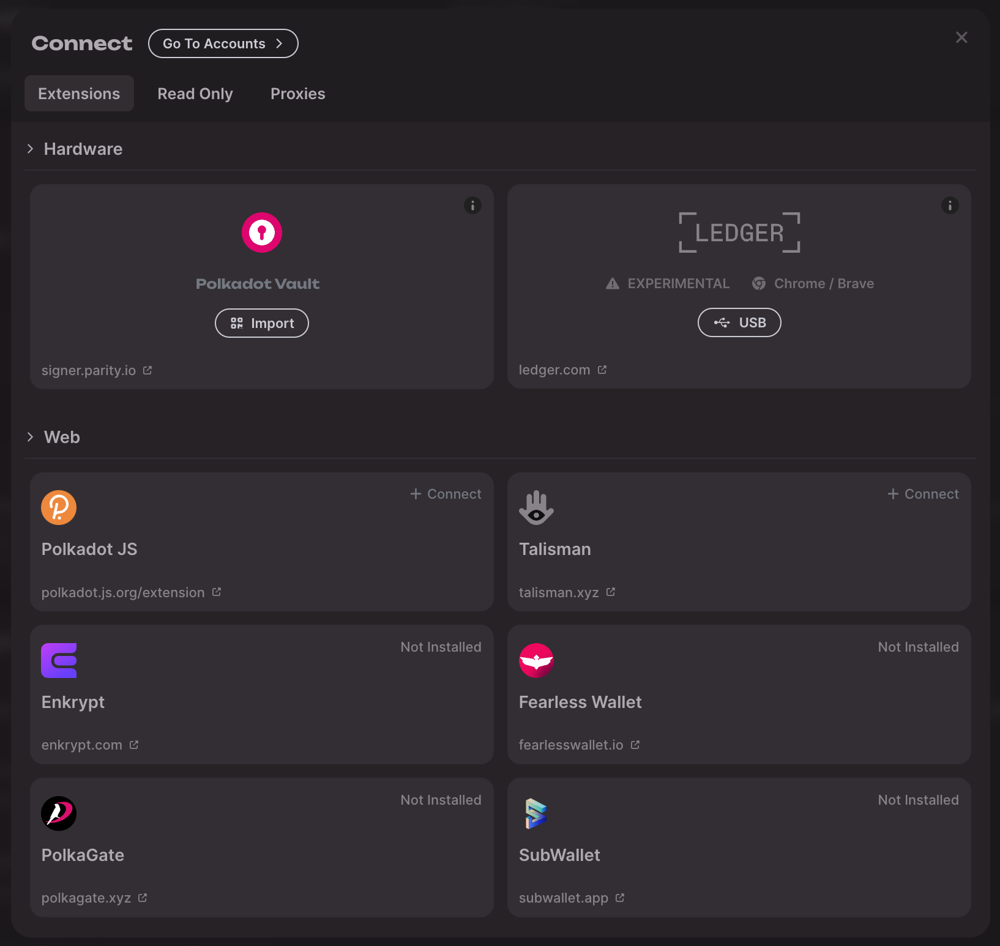
</a>
<figcaption style="font-size: 8px; text-overflow: ellipsis"><code>https://raw.githubusercontent.com/paritytech/substrate-assets/master/assets/polkadot-staking/screenshots/connect-dark.png</code></figcaption>
</figure>

<figure style="float: none; margin: 10px;">
<a href="assets/polkadot-staking/screenshots/kusama-dark.png">
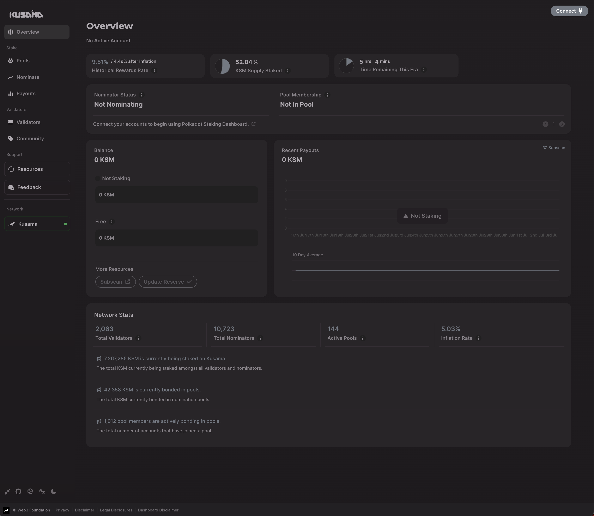
</a>
<figcaption style="font-size: 8px; text-overflow: ellipsis"><code>https://raw.githubusercontent.com/paritytech/substrate-assets/master/assets/polkadot-staking/screenshots/kusama-dark.png</code></figcaption>
</figure>

## Polkadot Events

Polkadot Events is a mobile App for iOS and Android

### icons

### screenshots

## Polkadot

Polkadot relay chain

### icons

<figure style="float: left; margin: 10px;">

<figcaption style="font-size: 8px; text-overflow: ellipsis"><code>https://raw.githubusercontent.com/paritytech/substrate-assets/master/assets/polkadot/icons/polkadot.svg</code></figcaption>
</figure>

<figure style="float: none; margin: 10px;">

<figcaption style="font-size: 8px; text-overflow: ellipsis"><code>https://raw.githubusercontent.com/paritytech/substrate-assets/master/assets/polkadot/icons/polkadot_icon.svg</code></figcaption>
</figure>

### screenshots

<figure style="float: none; margin: 10px;">
<a href="assets/polkadot/screenshots/polkadot.png">
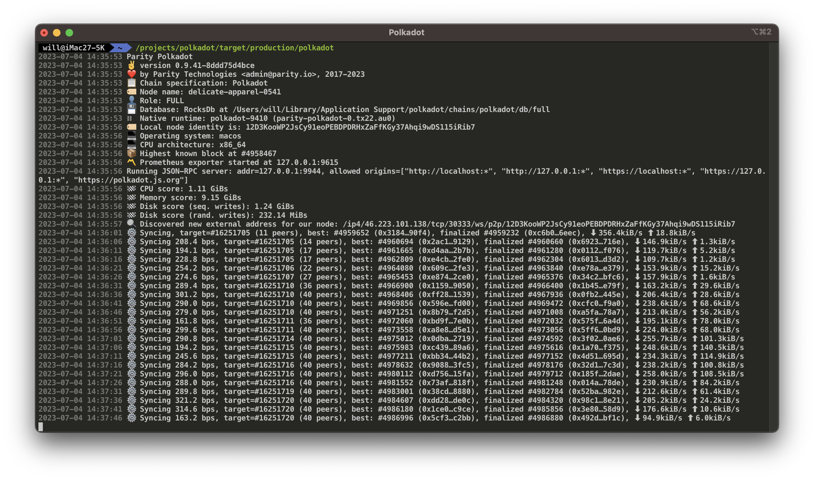
</a>
<figcaption style="font-size: 8px; text-overflow: ellipsis"><code>https://raw.githubusercontent.com/paritytech/substrate-assets/master/assets/polkadot/screenshots/polkadot.png</code></figcaption>
</figure>

## Polkadot Node Explorer

A simple Dashboard for a node

### icons

<figure style="float: none; margin: 10px;">

<figcaption style="font-size: 8px; text-overflow: ellipsis"><code>https://raw.githubusercontent.com/paritytech/substrate-assets/master/assets/polkadot-node-explorer/icons/pnex_512.svg</code></figcaption>
</figure>

### screenshots

<figure style="float: left; margin: 10px;">
<a href="assets/polkadot-node-explorer/screenshots/kusama.png">
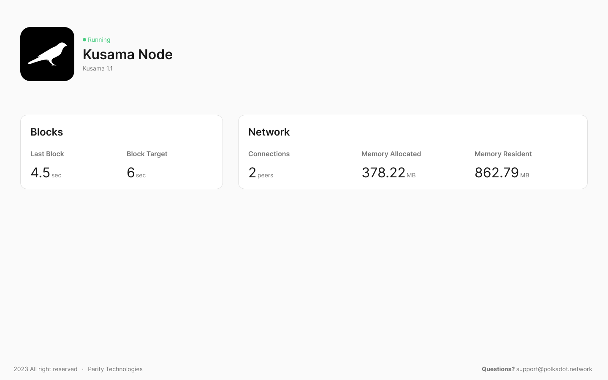
</a>
<figcaption style="font-size: 8px; text-overflow: ellipsis"><code>https://raw.githubusercontent.com/paritytech/substrate-assets/master/assets/polkadot-node-explorer/screenshots/kusama.png</code></figcaption>
</figure>

<figure style="float: none; margin: 10px;">
<a href="assets/polkadot-node-explorer/screenshots/polkadot.png">
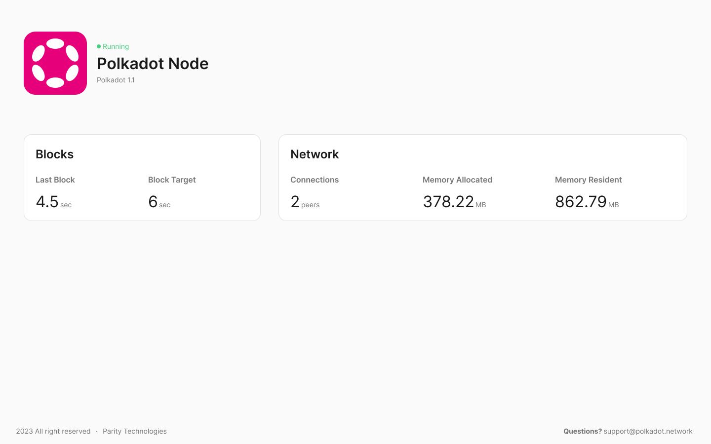
</a>
<figcaption style="font-size: 8px; text-overflow: ellipsis"><code>https://raw.githubusercontent.com/paritytech/substrate-assets/master/assets/polkadot-node-explorer/screenshots/polkadot.png</code></figcaption>
</figure>

